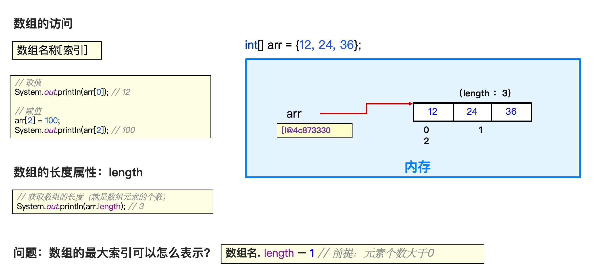
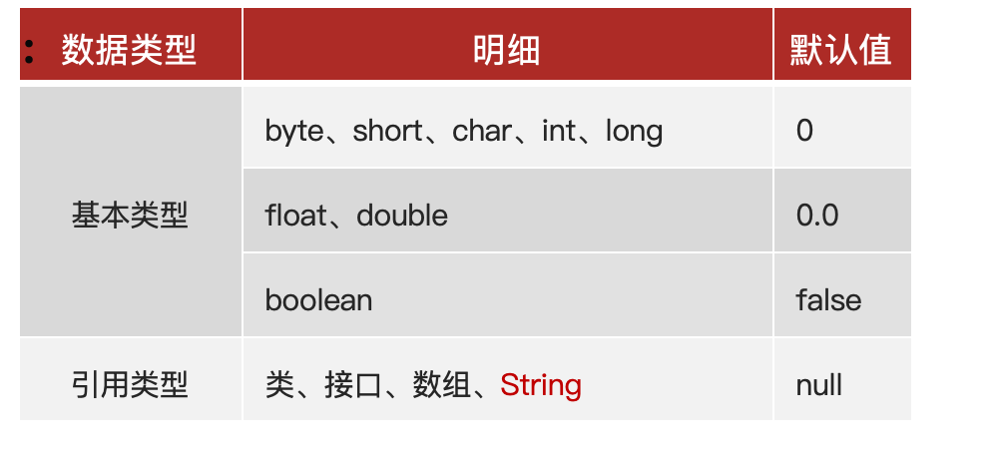

# 数组

> 数组：就是用来存储一批同种类型数据的容器。

### 例子

```java
20, 10, 80, 60, 90
int[] arr = {20, 10, 80, 60, 90};

牛二, 西门, 全蛋
String[] names = {"牛二", "西门", "全蛋"};

```

---

### 数组的定义

##### 1、静态初始化数组
> 定义数组的时候直接给数组赋值。

######  静态初始化数组的格式：
 ```java
// 完整格式
数据类型[]  数组名 = new 数据类型[]{元素1，元素2 ，元素3… };

double[] scores = new double[]{89.9, 99.5, 59.5, 88.0};
int[] ages = new int[]{12, 24, 36}
 ```

 ```java
// 简化格式
数据类型[] 数组名 = { 元素1，元素2 ，元素3，… };

int[] ages = {12, 24, 36};

 ```

#### 数组的访问



##### 2、数组的动态初始化
> 定义数组的时候只确定元素的类型和数组的长度，之后再存入具体数据。

######  数组的动态初始化格式：
 ```java
数据类型[]  数组名 = new 数据类型[长度];
int[] arr = new int[3];

// 后赋值
arr[0] = 10; 
System.out.println(arr[0]); // 10

 ```


### 元素默认值规则



